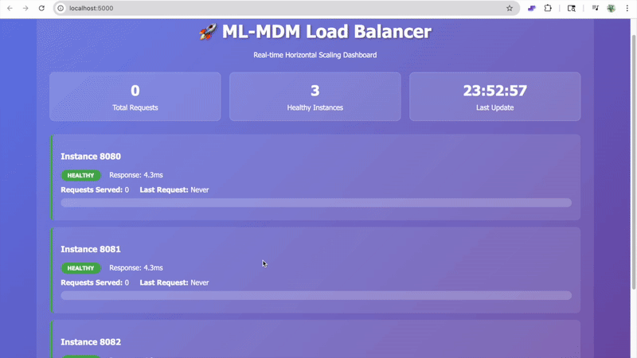
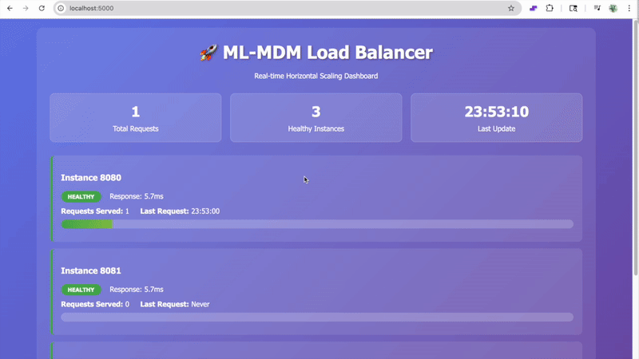
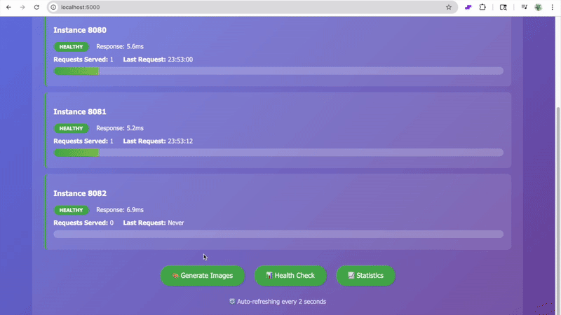
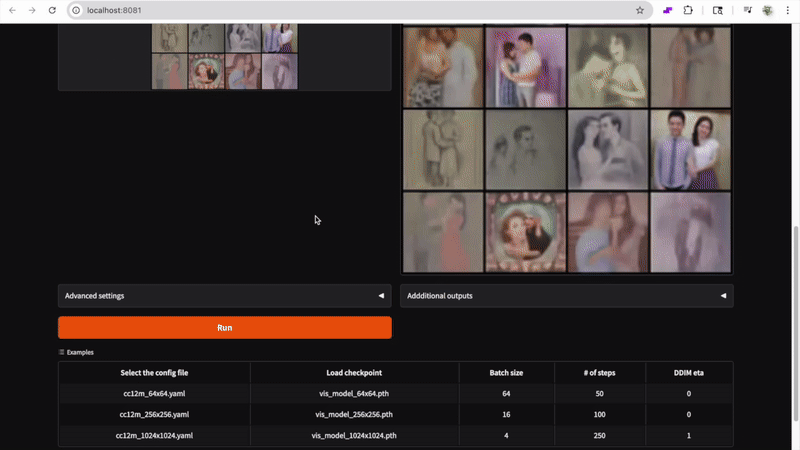

# ML-MDM Horizontal Scaling Studio

A production-ready, horizontally scalable text-to-image diffusion model system built on Apple's ML-MDM framework with Kubernetes deployment capabilities.

## 🚀 Features

- **Horizontal Scaling**: Distribute image generation across multiple CPU instances
- **Load Balancing**: Round-robin request distribution with health monitoring
- **Real-time Monitoring**: Live dashboard showing instance status and performance
- **Kubernetes Ready**: Complete deployment manifests for cloud scaling
- **Docker Support**: Containerized deployment with Docker Compose
- **Optimized Performance**: CPU-only mode with conservative defaults for stability

## 🎨 Visual Showcase

### Web Interface


### Image Generation Process





## 📊 Performance

| Setup | Throughput | Use Case |
|-------|------------|----------|
| Single Instance | ~2 images/minute | Development/Testing |
| 3 Instances | ~6 images/minute | Small Production |
| 15 Pods (K8s) | ~480 images/minute | Large Scale Production |

## 🛠️ Quick Start

### Local Development

1. **Clone and Setup**
```bash
git clone <repository-url>
cd Diffusion_GenStudio
python -m venv venv
source venv/bin/activate  # On Windows: venv\Scripts\activate
pip install -r requirements.txt
```

2. **Start Load Balanced Setup**
```bash
# Start 3 instances + load balancer
./scripts/setup.sh

# Access the dashboard
open http://localhost:5000
```

3. **Generate Images**
- Go to `http://localhost:5000`
- Enter prompt: "a majestic lion"
- Set parameters: Batch Size 4, Steps 8, Guidance 3.0
- Click "Generate Images"

### Docker Deployment

```bash
# Build and run with Docker Compose
docker-compose up --build -d

# Access load balancer
open http://localhost:80
```

## ☸️ Kubernetes Deployment

### Prerequisites
- Kubernetes cluster (minikube, EKS, GKE, AKS)
- kubectl configured
- Docker registry access

### Deploy to Kubernetes

```bash
# Deploy all resources
./deploy.sh

# Check status
./manage.sh status

# Scale to 5 replicas
./manage.sh scale 5

# Access via port forward
./manage.sh port-forward
```

### Kubernetes Features
- **Horizontal Pod Autoscaler**: Auto-scale based on CPU/memory
- **ConfigMaps**: External configuration management
- **LoadBalancer Service**: External access
- **Health Checks**: Liveness and readiness probes
- **Resource Limits**: CPU and memory constraints

## 📁 Project Structure

```
Diffusion_GenStudio/
├── ml-mdm/                          # Apple ML-MDM framework
│   └── ml-mdm-matryoshka/
│       ├── ml_mdm/clis/generate_sample.py  # Main generation script
│       ├── configs/models/cc12m_64x64.yaml # Model configuration
│       └── models/vis_model_64x64.pth      # Pre-trained model
├── deployment/                      # Deployment configurations
│   ├── k8s/                        # Kubernetes manifests
│   ├── docker/                     # Docker configurations
│   └── terraform/                  # Infrastructure as Code
├── load_balancer.py                # Load balancer with monitoring
├── docker-compose.yml              # Multi-container setup
├── requirements.txt                # Python dependencies
└── scripts/                        # Management scripts
    ├── deploy.sh                   # Kubernetes deployment
    ├── manage.sh                   # Cluster management
    └── setup.sh                    # Local setup
```

## 🔧 Configuration

### Model Parameters
- **Batch Size**: 1-16 (default: 1 for stability)
- **Inference Steps**: 1-8 (default: 8 for quality)
- **Guidance Scale**: 0.0-3.0 (default: 3.0 for prompt following)

### Load Balancer Settings
- **Strategy**: Round-robin with health checks
- **Health Check Interval**: 2 seconds
- **Instance Timeout**: 5 seconds
- **Auto-failover**: Enabled

## 📈 Monitoring

### Real-time Dashboard
- **URL**: `http://localhost:5000`
- **Features**:
  - Instance health status
  - Request count per instance
  - Response times
  - Auto-refresh every 2 seconds

### API Endpoints
- `GET /api/status` - Instance status JSON
- `GET /health` - Health check
- `GET /stats` - Load balancer statistics

## 🚀 Scaling Options

### Local Scaling
```bash
# Scale Docker Compose to 5 instances
docker-compose up --scale ml-mdm-generator=5 -d
```

### Kubernetes Scaling
```bash
# Manual scaling
kubectl scale deployment ml-mdm-generator --replicas=10

# Auto-scaling (HPA)
kubectl autoscale deployment ml-mdm-generator --cpu-percent=70 --min=2 --max=15
```

## 🔒 Security

- **CPU-only execution**: No GPU dependencies
- **Resource limits**: Prevents resource exhaustion
- **Health checks**: Automatic failure detection
- **Isolated containers**: Process isolation

## 🐛 Troubleshooting

### Common Issues

**Port conflicts**:
```bash
# Check port usage
lsof -ti:8080,8081,8082,5000

# Kill conflicting processes
pkill -f "generate_sample.py"
```

**Memory issues**:
```bash
# Reduce batch size in web interface
# Or modify generate_sample.py:
batch_size = min(batch_size, 4)  # Reduce from 16 to 4
```

**Kubernetes issues**:
```bash
# Check pod status
kubectl get pods

# View logs
kubectl logs -f deployment/ml-mdm-generator

# Restart deployment
kubectl rollout restart deployment/ml-mdm-generator
```

## 📚 Documentation

- [Kubernetes Deployment Guide](README-Kubernetes.md)
- [Testing Guide](TESTING-GUIDE.md)
- [Deployment Documentation](docs/DEPLOYMENT.md)

## 🤝 Contributing

1. Fork the repository
2. Create a feature branch
3. Make your changes
4. Test with local setup
5. Submit a pull request

## 📄 License

This project builds upon Apple's ML-MDM framework. Please refer to the original [ML-MDM license](ml-mdm/LICENSE) for details.

## 🙏 Acknowledgments

- Apple ML-MDM team for the original framework
- Gradio for the web interface
- Kubernetes community for orchestration tools

---

**Ready to scale your image generation? Start with the local setup and scale to Kubernetes when ready!**